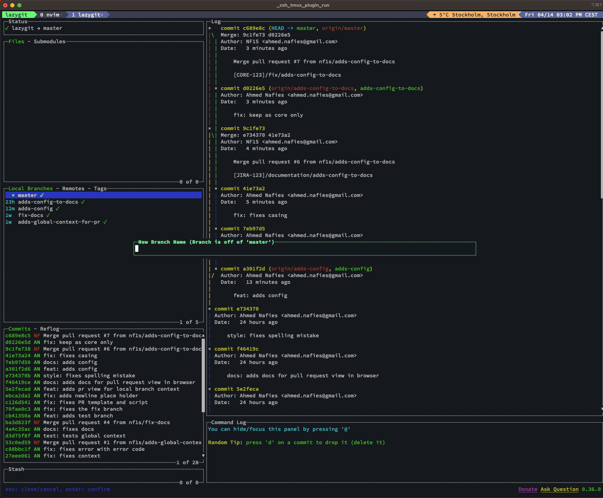
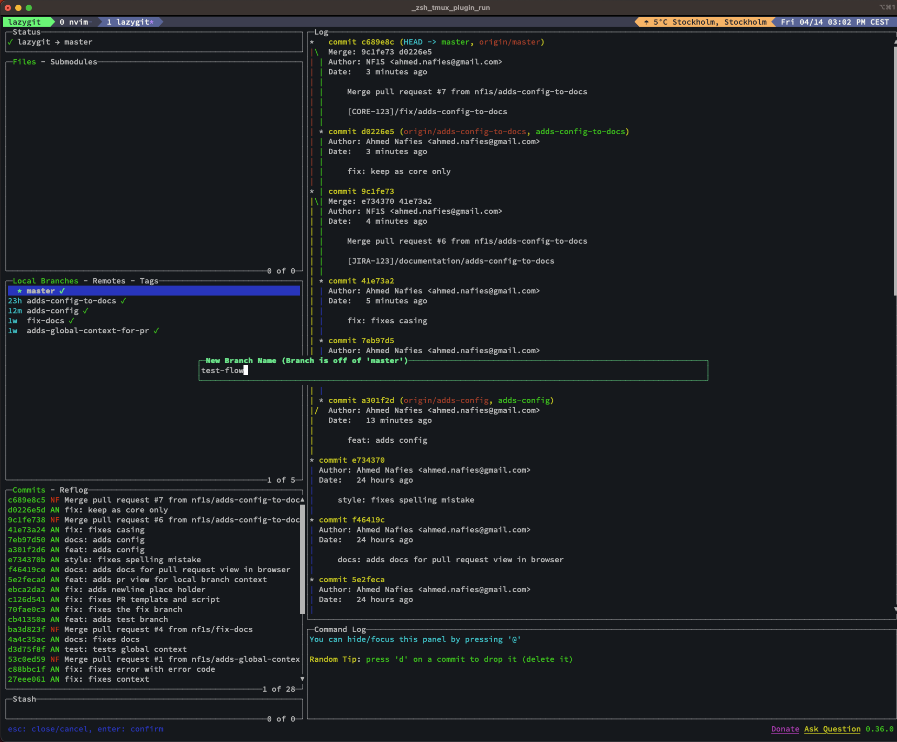
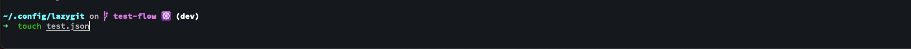
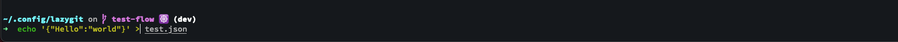
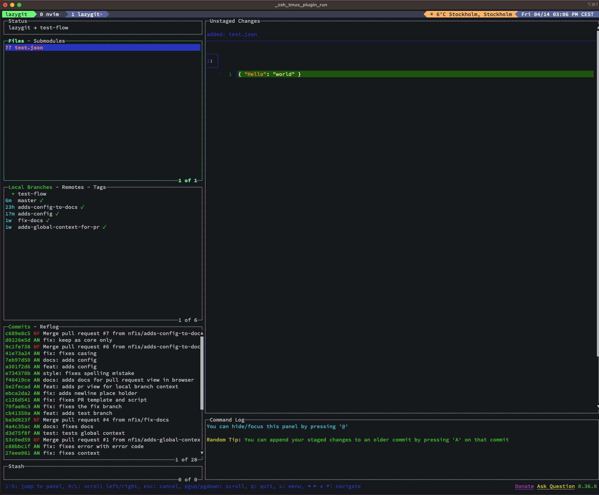
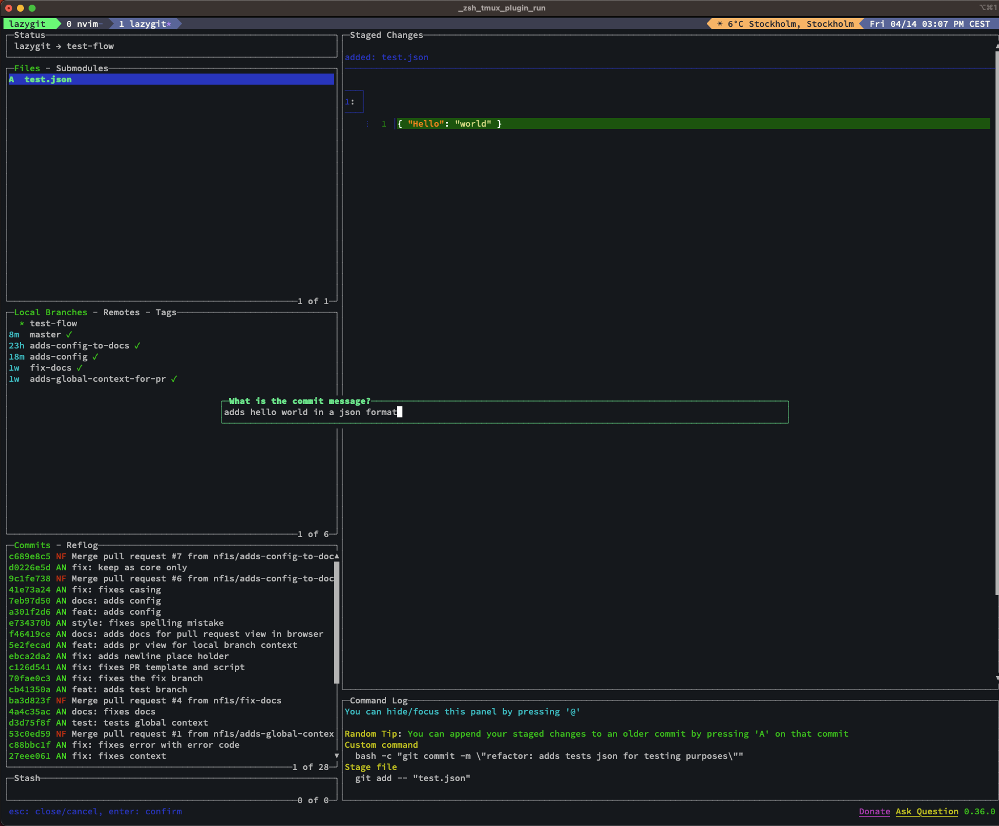
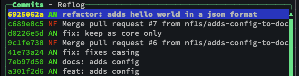
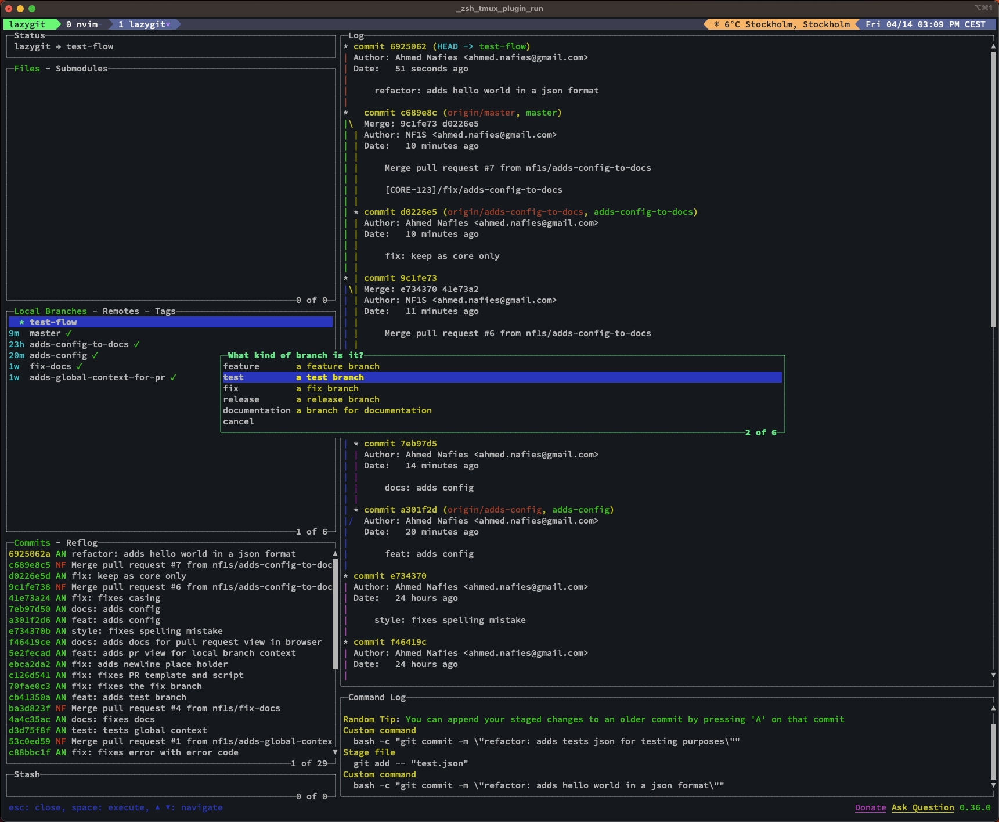
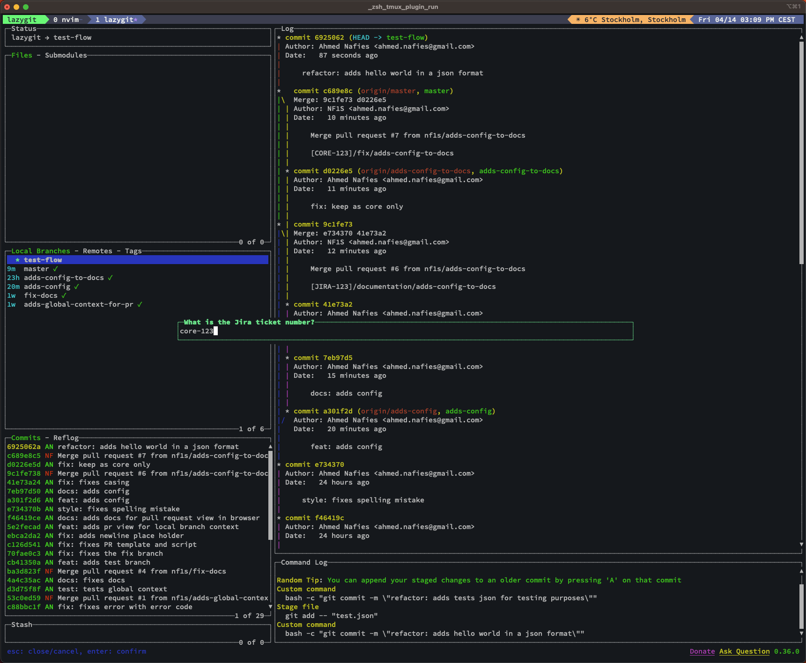
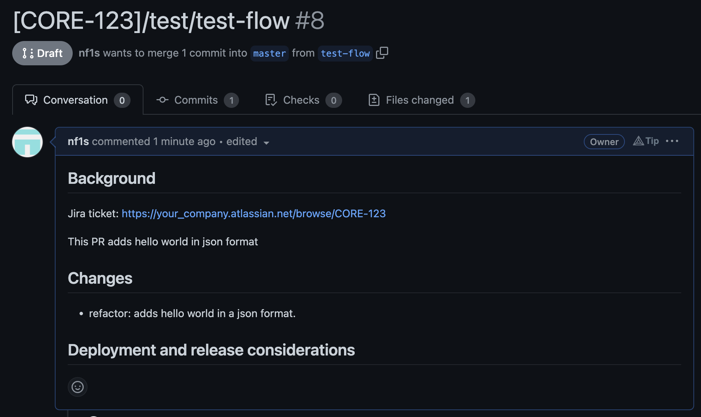

# Lazygit

## Features

- conventional commits.
- PR creation from template.

## Usage

- `c` to create commits with conventional commits. (must be in files context)
- `b` create a pull request from template, then open the pr in a new window
- `v` view pr in web browser (must be in localBranches context)

## Setup

```bash
$ git clone https://github.com/nf1s/lazygit.git ~/.config/lazygit
```

## Configure

```
$ touch config.cfg
```

### Add your Jira ticket prefix to `config.cfg`

```bash
# Jira tickets are usually prefixed with the project name, e.g. "ABC-1234".
# In this case, the JIRA_TICKET_PREFIX should be set to is "ABC".
# We can add multiple prefixes by separating them with a comma, e.g. "ABC,DEF"
# JIRA_TICKET_PREFIX is case insensitive.
# JIRA_COMPANY is your Jira workspace usually like `your_company.atlassian.net`
# In this case, JIRA_COMPANY=your_company
CHECK_JIRA_TICKET_PREFIX=true
JIRA_TICKET_PREFIX=core,Ops
JIRA_COMPANY=your_company
```

## Start

```bash
$ lazygit -ucd ~/.config/lazygit
```

If you use zsh, add alias to your .zshrc

```bash
alias lazygit="lazygit -ucd ~/.config/lazygit"
```

```bash
$ lazygit
```

## Example

### Creating a new branch

- Go to the local branches context and press `n`



- Add branch_name



- Create a new file `test.json`



- Add to some data to the file



- Press `Space` to stage the file



- Add commit message



- Check commit log



- While in the Files or Branches context press `b` to create a new PR



- Add Jira ticket number



- Lazygit will automatically create a PR from template.
- Will automatically open the browser for the PR.


